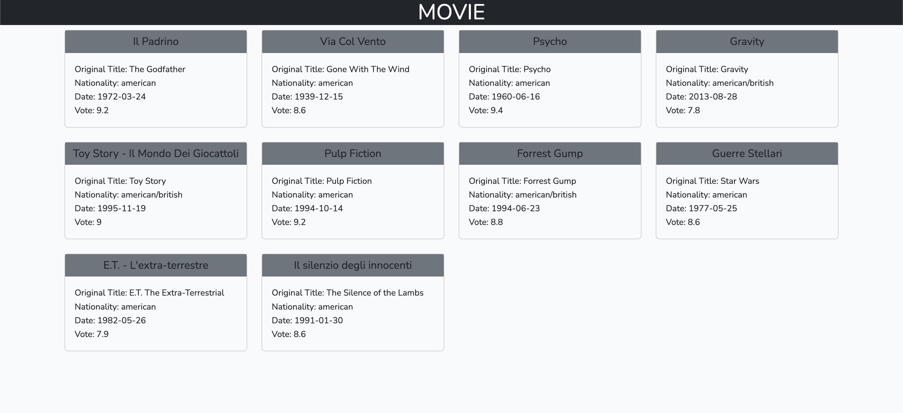

# LARAVEL MODEL CONTROLLER

## consegna

1 - Create un nuovo progetto Laravel
2 - tramite phpMyAdmin o MySQL Workbench create un nuovo database laravel_model_controller
3 - Importate nel vostro database la tabella movies in allegato
4 - inserite le vostre credenziali per il database nel file .env
5 - Create un model Movie.php col comando php artisan make:model Movie
6 - Create un controller che gestirà la rotta / col comando
php artisan make:controller Guest/PageController
7 - All’interno della funzione index() del controller, recuperate tutti i film dal database e passateli alla view, che quindi li visualizzerà a schermo, tramite delle card.

## risultato finale -->

